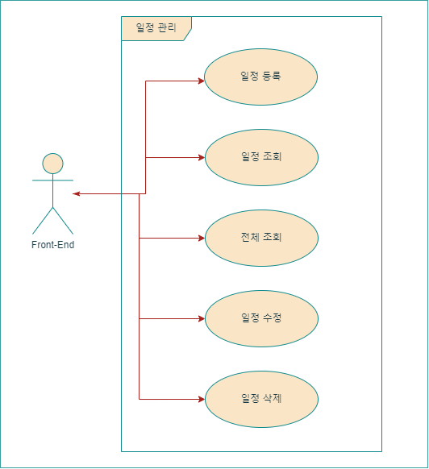
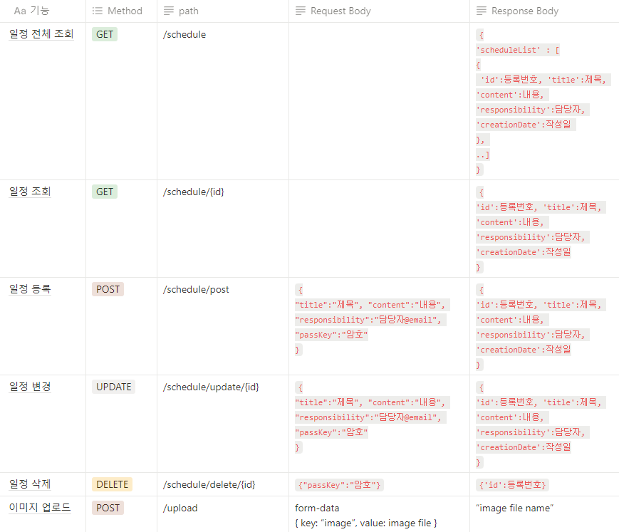
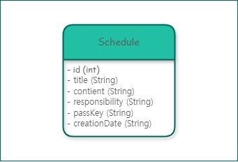

# 🥣 _Bizee_ : 일정 관리 앱 서버

## 개요

> ### _**Bizee**_ 는 일정(Schedule)을 관리하고 공유할 수 있는 *웹 애플리케이션 서버*입니다.
> 
> 'Bizee'는 'Busy'의 발음을 가져와 만들어졌습니다.
> 

> ### 프로젝트 설명
> 웹에서 일정을 등록하고, 조회, 수정, 삭제를 할 수 있습니다.
>
> http 요청에 대한 API 기능만 동작하며, 테스트 시에는 [postman](https://web.postman.co/)같은 도구를 사용합니다. (+추가: Swagger)
> 
> 본 프로젝트는 내일배움캠프 과제로 사용되었습니다.
> 
## 요구사항

> ### 기능 요구사항
> 0. 공통 조건
>   - 일정 작성, 수정, 조회 시 반환 받은 일정 정보에 `비밀번호`는 제외
>   - 일정 수정, 삭제 시 선택한 일정의 `비밀번호`와 요청할 때 함께 보낸 비밀번호가 일치하는 경우에만 가능
> 
> 
> 1. 일정 등록
>   - `할일 제목`, `할일 내용`, `담당자`, `비밀번호`, `작성일`을 저장할 수 있습니다.
>       - 저장된 일정 정보를 반환 받아 확인할 수 있습니다.
>
> 
> 2. 조회 
>   - 선택한 일정의 정보를 조회할 수 있습니다.
> 
> 
> 3. 일정 목록 조회 (전체 조회)
>   - 등록된 일정 전체를 조회할 수 있습니다.
>   - 조회된 일정 목록은 `작성일` 기준 내림차순으로 정렬되어있습니다.
> 
> 
> 4. 수정
>   - 선택한 일정의 `할일 제목`, `할일 내용`, `담당자`를 수정할 수 있습니다.
>     - 서버에 일정 수정을 요청할 때 `비밀번호`를 함께 전달합니다.
>   - 수정된 일정의 정보를 반환받아 확인할 수 있습니다.
> 
> 
> 5. 삭제
>   - 선택한 일정을 삭제할 수 있습니다.
>     - 서버에 일정 삭제를 요청할 때 `비밀번호`를 함께 전달합니다.
> 
> 
> 6. 예외 처리
>   - 다음과 같은 예외 상황에 대한 처리를 위해 HTTP 상태코드와 에러메시지를 포함한 정보를 사용하여 예외를 관리할 수 있습니다.
>   - 수정, 삭제 시 요청할 때 보내는 `비밀번호`가 일치하지 않을 때
>   - 선택한 일정 정보가 이미 삭제되어 조회할 수 없을 때
>   - 삭제하려는 일정 정보가 이미 삭제 상태일 때
>
>
> 7. 유효성 검사
>   - 잘못된 입력이나 요청을 미리 방지할 수 있습니다.
>     - `할일 제목`은 최대 200자 제한, 필수 입력
>     - `비밀번호`는 필수 입력
>     - `담당자`는 이메일 형식
>
>
> 8. Swagger UI
>   - API 목록 확인, 테스트가 가능합니다.
>
>
> 9. 파일 업로드 & 다운로드
>   - 사용자는 파일을 업로드할 수 있습니다. 업로드된 파일은 개인 PC에 저장합니다.
>     - 특정 파일 형식만 업로드합니다. (JPG, PNG, JPEG)
>
>
> 10. 테스트 코드 작성
>    - 사용자는 파일을 업로드할 수 있습니다. 업로드된 파일은 개인 PC에 저장합니다.
>    - 코드 커버리지를 높이기 위해 `Jacoco`를 활용하여 테스트 코드가 대상 코드를 80% 이상 커버하도록 목표를 설정합니다.

> ### 프로그래밍 요구사항
>
> 1. Spring Boot를 사용하여 CRUD 기능이 포함된 REST API를 설계합니다.
> 
> 
> 2. 수정, 삭제 API 요청(reqeust) 방식은 **body** 방법을 사용합니다.
> 
> 
> 3. Entity를 그대로 반환하지 않습니다. (DTO를 사용)

 

## Use Case Diagram

 

## API 명세

 

## Entity-Relation Diagram

     - 변경사항: -creationDate 타입 변경 (String --> LocalDateTime)

 

## 구현해야 할 기능

자세히

### 1. Model Entity, DTO 구현
    - 작성한 ERD를 참고하여 Entity 구현
    - RequestDto: 클라이언트 리소스 정보를 담은 객체, 기능별 API에 맞는 constructor를 구현
    - ResponseDto: 클라이언트에게 전달할 리소스 정보를 담은 객체, 기능별 API에 맞는 정보만 객체에 담아 리턴

### 2. 등록 구현 (POST)
    - http payload로 JSON 형식 데이터가 전달됨 -> @RequestBody 사용
    - Schedule 객체를 담는 Map 컬렉션 존재
    - Map의 key인 등록번호(id)는 순차적 생성
    - Schedule 객체를 ResponseDto를 통해 반환 (passkey 제외)

### 3. 조회 구현 (GET)
    - url에 path variable(id)이 전달됨 -> @PathVariable 사용
    - Map에서 id에 해당하는 Schedule을  ResponseDto을 통해 반환 (passkey 제외)

    - 예외상황 ) 잘못된 id값

### 4. 전체 조회 구현 (GET)
    - 클라이언트 전달 데이터가 없음
    - Schedule 정보가 있는 Map 컬렉션을  List<ResponseDto>로 매핑해 반환 (passkey 제외)

### 5. 수정 구현 (PUT)
    - http payload로 JSON 형식 데이터가 전달됨 -> @RequestBody 사용
    - Map에서 id에 해당하는 Schedule을 찾아 passkey가 일치하는지 확인
    - 일치하면 내용을 update
    - update된 Schedule 인스턴스를 ResponseDto를 통해 반환 (passkey 제외)

    - 예외상황 ) 1. 잘못된 id값  2. passkey 불일치

### 6. 삭제 구현 (DELETE)
    - http payload로 JSON 형식 데이터가 전달됨 -> @RequestBody 사용
    - Map에서 id에 해당하는 Schedule을 찾아 passkey가 일치하는지 확인
    - 일치하면 인스턴스 제거
    - 제거에 성공하면 id를 반환

    - 예외상황 ) 1. 잘못된 id값,  2. passkey 불일치

### 7. 예외 처리
    - 에러 정보를 담는 ErrorResponseDto 정의
    - 전역에서 발생하는 Controller의 예외 throw를 캐치해주는 핸들러 ExceptionController 클래스 정의
    - @ResponseBody를 사용하여 JSON으로 변환 후 반환
    - 반환 정보는 Http Status에 해당하는 값, throw 시에 보낸 메시지
    - 아직 다양한 에러코드 구성은 x --> 전부 400 처리

### 8. 유효성 검사
    - @Valid 애노테이션 사용을 위한 의존성 추가 {implementation 'org.springframework.boot:spring-boot-starter-validation'}
    - @RequestBody 객체로 Request 받는 부분은 @Valid로 관리하고 해당 클래스에서 유효성 검사
    - 검사할 Atrribute들에 @NotBlank, @Size(문자열 크기 지정), @Email 적용
    - @PathVariable 같은 단일 값은 @Valid를 사용하지 않고 바로 @NotBlank 등 유효성 검사, 클래스에 @Validated 추가
    - 검증에 실패 : throw MethodArgumentNotValidException --> 예외 핸들링 구현

### 9. Swagger
    - 의존성 추가 {implementation 'org.springdoc:springdoc-openapi-starter-webmvc-ui:2.2.0'}
    - Swagger UI를 확인: http://localhost:8080/swagger-ui/index.html 로 접속

### 10. 파일 업로드 기능 & 서버 로컬 PC에 다운로드
    - application.properties에 업로드할 폴더 위치 설정
    - FileController 구현

 

## 프로젝트 진행 계획

1. 어떤 프로젝트인지와 구현해야 할 기능을 대략적으로 작성
    - 과제에 진행에 필요한 내용들을 [README.md](./README.md)에서 모두 볼 수 있도록 작성
2. 요구사항에 맞는 [Use Case Diagram](#Use-Case-Diagram), [API 명세서](#API-명세), [ERD 작성](#Entity-Relation-Diagram)
3. [구현해야 할 기능](#구현해야-할-기능)에 대한 세부적인 추가 기능 및 예외 처리 목록 작성
    - 구현 방법과 예외 처리에 대한 간략한 설명 및 계획 추가
4. [구현해야 할 기능](#구현해야-할-기능) 순서대로 Class 생성 및 코드 작성
    - 구현해야 할 기능에 따른 Class 설정
5. 추가 구현 기능 문서 작성
6. 예외 발생 처리 구현
7. 유효성 검사 (@Valid) 구현
8. Swagger 구현
9. 클라이언트 파일을 서버에 업로드 구현
10. 일정 목록 전체조회 -> 작성일 기준 내림차순 누락 확인 후 수정
11. 리팩토링 :: 3-Layer Architecture 구현
12. 리팩토링 :: DB 추가, 단순 이미지 업로드 기능을 일정 관리 사이드에 유저 이미지 등록 기능으로 변경
13. 구조에 맞게 ERD, UseCase 수정
14. API 명세서 외부 툴 사용 이미지로 교체

 